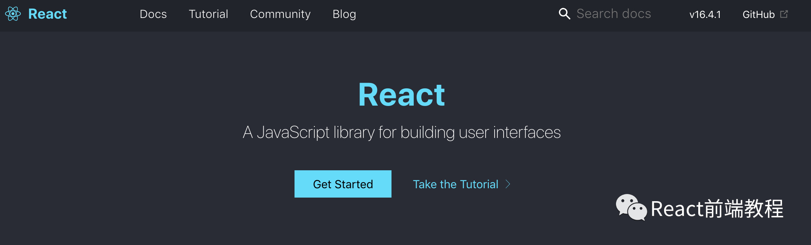
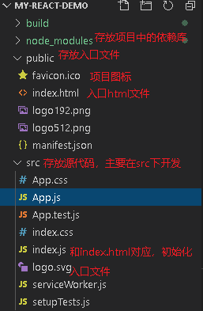
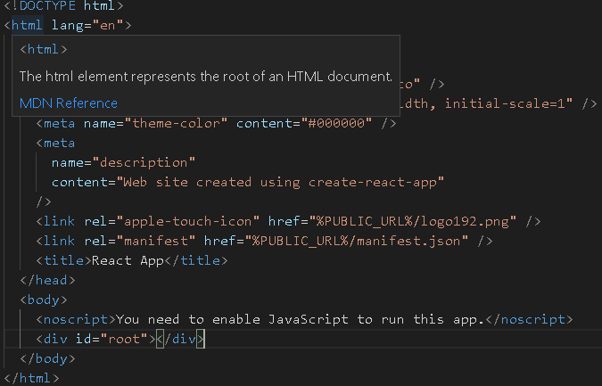
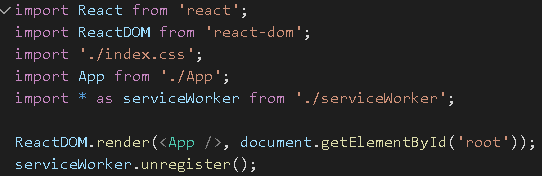

## React 项目创建
### 1.进入React官网



按照下图指示查看构建React项目的命令，我们可以看到如果要构建react，我们首先要安装node环境（图）

### 2.Nodejs & NPM
如果你还没有node环境，建议首先安装node，进入node官网(https://nodejs.org/en/)下载安装即可。最新的React文档使用npx命令构建项目，需满足node版本6.0+和npm版本5.2+。
```
node -v
npm -v
```
### 3.安装create-react-app0
```
npm install create-react-app
```
### 4.构建一个react项目
```
npx create-react-app my-react-demo
cd my-react-demo
npm start
```
### 5.查看
安装完成后执行npm start命令 会自动在浏览器弹出的demo示例，效果图如下：（图）

## React文件结构和JSX语法


入口文件index.html中的根节点



可以发现body里面就是单纯的一个div，添加了id=“root”，



ReactDOM.render()是React的最基本方法用于将模板转为HTML语言，并插入指定的DOM节点，而App.js文件就是我们界面的源码（图）

### JSX语法（官网的解释很详细）
```
const element = <div className="mydemo">React</div>;
```
一种标签语法，既不是字符串也不是 HTML，是JavaScript 的语法扩展。
--className表示class,而class样式现在.css文件中
--用{}调用变量
--tabindex变为tabIndex 
--只能有一个根容器,上面如果添加一个和<div className="App"></div>同级节点将会报错

## React-组件的作用
随着前端页面逻辑的加重，为了降低开发难度与维护成本， 所以现在比较好的框架都会对组件化做一定程度的实现。将复杂的业务逻辑分为很多个业务模块儿，开发人员只需要有针对性的维护相应的模块儿，降低维护成本。

### 组件的创建
React 通过创建js（或jsx）文件来创建。
例如：创建一个Person.js文件(在React中，我们约定成俗的习惯是组件命名首字母大写)，具体定义形式如下：
引入react
```
import React from 'react'
````
1. 函数式组件

```
function App() {
  return (
    <div className="App">
      <Person />
    </div> 
  );
}
```
2. es6方式创建组建
```
class Person extends Component { 
  render() { 
    return 
      <div>
        <p>姓名</p>
        <p>年龄</p>
      </div>
    }
}
```
3. es5方式创建组件
```
var Person = React.createClass({
  render: function() {
    return (
      <div>
        <p>姓名</p>
        <p>年龄</p>
      </div>
    )
  }
});
```
### 组件的引入与导出
```
引入
import Person from './Person';
```
```
导出
export default Person;
```
这里需要注意:如果我们引入自定义模块，需要写相对路径；如果引入npm安装的模块，可以直接写模块名


