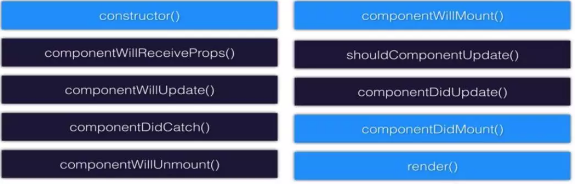
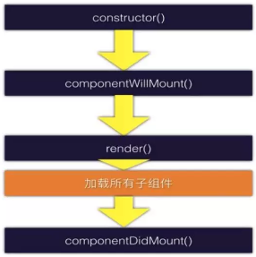
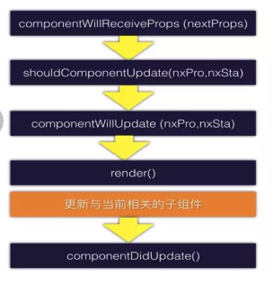

### React条件渲染
在React中，常用的条件语句有if语句、三元操作符、逻辑(&& ||)语句、switch...case等。

通过控制state的状态控制是否渲染
```
toggleHandler = () => {
    const { show } = this.state;
    this.setState({
      show: !show,
    });
}

render() {
const { show } = this.state;
let person = null;
if (show) {
  person = <p>my name is Lucy，i am 18 years old.</p>
}
return(
  <div>
    <button onClick={this.toggleHandler}>显示/隐藏</button>
    {person}
  </div>
)
或者
render() {
  const { show } = this.state;
  return (
    <div>
      <button onClick={this.toggleHandler}>显示/隐藏</button>
      {show && (<p>my name is Lucy，i am 18 years old.</p>)}
    </div>
  )
}
```
### React循环的使用
在开发过程中，使用循环可以大大提高我们的开发效率。


### React动态修改样式和类别
1. 在.css文件中定义样式，用className引用
2. 内联样式, 用{{}}包裹 或者写在变量中引用 
```
state = {
  classes: ['red'],
};

addClasses = () => {
  let { classes } = this.state;
  if (classes.length < 2) {
    classes.push('bold');
    this.setState({
    classes,
    });
  }
}

const { classes } = this.state;
const style = {
  backgroundColor: 'green',
  border: '1px solid blue',
  color: 'white'
};
return (
  <div>
    <button style={style} onClick={this.addClasses}>更改样式状态</button>
    <p style={{ fontSize: '16px' }} className={classes.join("")} >my name is Lucy，i am 18 years old.</p>
  </div>
)
```
### React-有状态组件和无状态组件
在React中组件分为两种类型-有状态组件和无状态组件
1. 有状态组件
有状态组件是一个class类，继承Component, 有状态state, 有生命周期
```

```
2. 无状态组件
无状态组件是一个函数，不能使用state, 用props传递数据，无生命周期
```
const App = (props) => { 
  return(
    <div className="App">
      <PersonB />
    </div>
  )
}
```
### React-生命周期钩子函数
在React中，生命周期钩子函数主要是针对于有状态的组件



首次加载时调用的钩子函数：



constructor(): 构造函数，在创建组件时调用一次。这是es6提供的方法
componentWillMount(): 组件挂载之前调用一次。可以在这里初始化state，这时会在render中看到。
render(): 
--这是React组件所必不可少的核心函数（上面的其它函数都不是必须的），
--在这个方法中进行创建虚拟dom并更新dom。
--不能在rander修改state,会引起死循环。
--并不是一次setState会触发一次render，React可能会合并操作，再一次性进行render。

componentDidMount()：渲染完毕后执行
--在这个方法中，如果我们更新state,就会重新render(),render更新完后又会执行componentDidMount(),从而引起死循环，所以在这个方法中不能更新状态。

当所有子组件加载完成之后父组件才会执行 componentDidMount()

更新组件是调用的钩子函数：

当有状态组件的state值发生变化时触发的生命周期钩子函数及执行顺序如图所示：



componentWillReceiveProps(nextProps)
在接受父组件改变后的props需要重新渲染组件时用到的比较多

shouldComponentUpdate(nextProps,nextState)
唯一用于控制组件重新渲染的生命周期。因为react父组件的重新渲染会导致其所有子组件的重新渲染，这个时候其实我们是不需要所有子组件都跟着重新渲染的，因此需要在子组件的该生命周期中做判断。在这里return false可以阻止组件的更新

componentWillUpdate(nextProps,nextState)
shouldComponentUpdate返回true以后，组件进入重新渲染的流程，进入componentWillUpdate,这里同样可以拿到nextProps和nextState

componentDidUpdate(prevProps,prevState)
组件更新完毕后，react只会在第一次初始化成功会进入componentDidmount,之后每次重新渲染后都会进入这个生命周期，这里可以拿到prevProps和prevState，即更新前的props和state。